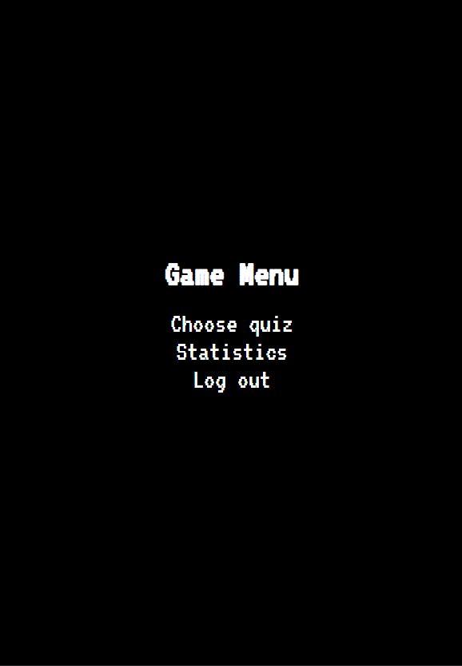
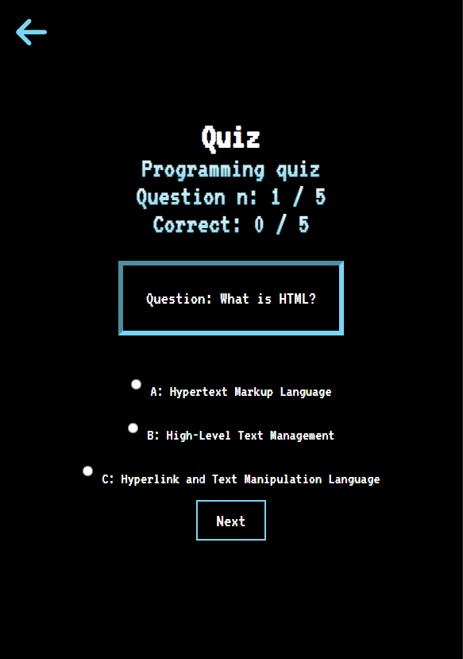

# Quiz Application Readme

Welcome to the Quiz Application! This application allows users to participate in quizzes, both with and without registration. Registered users can track their quiz statistics, while an administrator manages quizzes.

## Features

### User Features

1. **Quiz Participation:**
   - Users can take quizzes without the need for registration.
   - Registered users can log in to track their quiz progress.

2. **Quiz Statistics:**
   - Registered users have access to their quiz statistics, showcasing performance and progress.

### Administrator Features

1. **Quiz Management:**
   - Administrators can create, edit, and delete quizzes.

## Getting Started

### Prerequisites

1. **Node.js and npm:**
   - Ensure that Node.js and npm are installed on your machine. You can download them from [here](https://nodejs.org/).

2. **MySQL:**
   - Install and configure MySQL. You can find the installation guide [here](https://dev.mysql.com/doc/mysql-installation-excerpt/5.7/en/).

### Installation

Clone the repository:

```bash
git clone https://github.com/Maikelek/QuizApp
```
Install Dependencies for client:
```bash
cd client
npm install
```
Install Dependencies for server:
```bash
cd server
npm install
```

Configure Enviroment variables (create .env file in /server):
```
PORT = 1234

HOST = localhost
DEV = root
PASSWORD = 
DATABASE = quiz_app

JWT_SECRET = e90fc1788a12042982ff8dc16bcd529034fcac14880a0e2586443b4d67792a60be1a69e00b6275e1216ceb16f64ed78b34685ec36891a32cbb0062acdaf042e1
```

## Run the application

1. Open 2 terminals
2. Start server:
```bash
cd server
npm start
```
- Backend should now be running at http://localhost:1234 
3. Start client:
```bash
cd client
npm start
```
- Frontend should now be running at http://localhost:3000 

# Project preview

## Main page


## Quiz page


## Phone main page


## Phone quiz page


# Technologies used
 * **Frontend:**
   - React
   - Jsx (JavaScript XML)
   - Vanilla css

 * **Backend**
   - MySQL
   - Express.js 

##
Feel free to reach out with any questions or issues. Happy quizzing! 🎉
##
